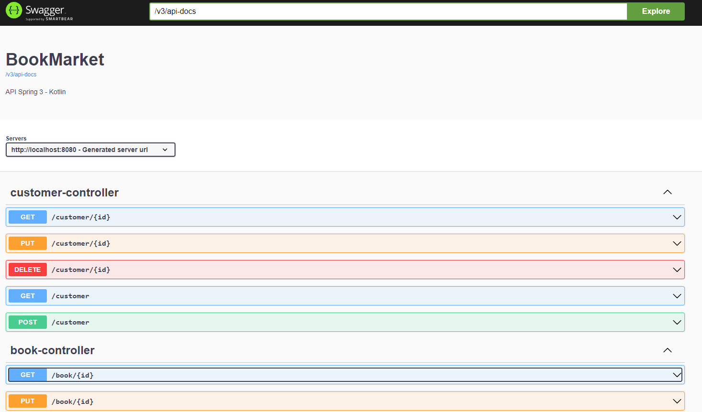

<h1 align="center">Book Market</h1>

 🚀 Kotlin com Spring

<h1 align="center"></h1>

•
 <a href="#objetivo">Objetivo</a> •
 <a href="#tecnologias">Tecnologias</a> • 
 <a href="#autor">Autor</a> •

<h1 align="center">
    
    

</h1>

## **Objetivo**

 🔍 Aprendendo a criar uma API com Kotlin e Spring 

## **Tecnologias**

<ul> ⚙️ Visão Geral
    <li>🛠 Kotlin
    <li>🛠 Spring Security
    <li>🛠 Spring Validator
    <li>🛠 Spring Framework
    <li>🛠 Spring Data
    <li>🛠 Eventos

</ul>

## **Autor**

 Desenvolvido por <a href="https://github.com/valtercfjunior">Valter Junior</a>, seguindo o curso <a href="https://www.udemy.com/course/kotlin-spring/">Kotlin e Spring do ZERO ao Avançado
</a> 

